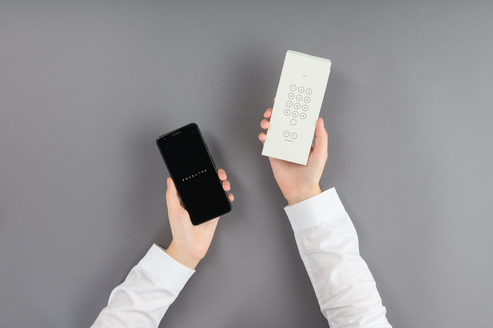
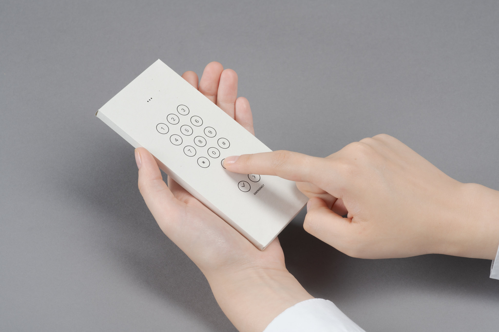
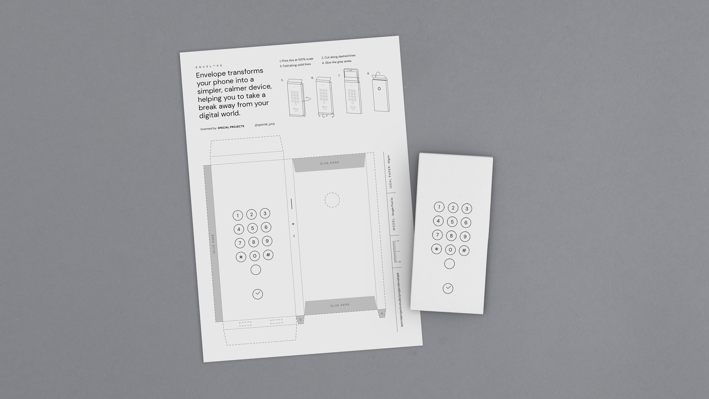

# Envelope

A set of envelopes which temporarily transform your phone into a simpler, calmer device, helping you take a break away from your digital world.
One envelope turns your phone into a very basic device which can only make and receive calls, while the other turns your phone into a photo and video camera with no screen, helping you focus on what’s in front of you.

Please note this currently only works on the Google Pixel 3a

This code is for an app which lets you use an envelope to make and receive calls only. 
Once inside an envelope your device will act as a simple phone, which only allows you to make and receive calls.

We hope this little experiment can help you try a digital detox from technology and help you focus on the things that matter the most.

Envelope is an experimental open source Android app which is available to try right now. All of the code is available on Github for people to play with and hopefully adapt and evolve! 

[Try the app on the Google Play Store](https://play.google.com/store/apps/details?id=com.specialprojects.experiments.envelopecall)

[Find out even more on our site](http://specialprojects.studio/project/envelope)
